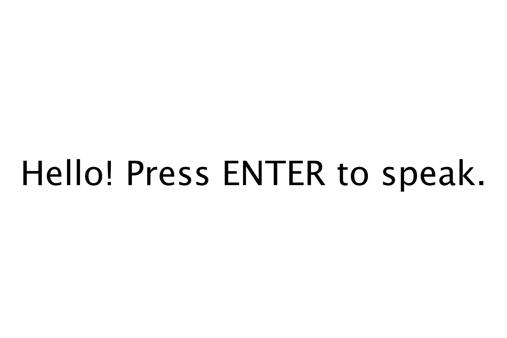

Spelling Bee - ttslib
=====================

Spelling Bee 是小學裡面的一種英文競賽, 由出題者唸出英文單子, 小朋友們就試著把英文單字拼出來。我猜可能這些小朋友們在拼字時, 就像蜜蜂一樣, 所以叫 Spelling Bee 吧。

因為我家兒子的寒假作業, 學校規定要背 Spelling Bee 的單字, 我就想要寫個程式, 來模式這樣的競賽過程: 先唸出發音, 接下來小朋友要把單字拼出來。

在這裡面, 最重要的一步, 是要能讓電腦發出聲音, 所以我就找了一下 Processing 看有沒有相關的 Text-to-Speech library可以用。我找到 ttslib, 它是使用 [FreeTTS](https://en.wikipedia.org/wiki/FreeTTS) 來發出聲音, 不過可能因為是比較早期(2000-2009)的工具, 聲音還不太好聽。


使用ttslib
----------
這個版本使用 Processing 可找到的 Text-to-Speech library: ttslib。 ttslib 是由 Nicolaus Gradwohl 所製作的 Processing library, 只要給它單字的字串, 它就會發音唸出來。使用 ttslib 來開發程式時, 需要幾個步驟:

- (1) 在 Processing 裡, Sketch-Library-Add Library, 找 tts 找到 ttslib, 請安裝它
- (2) 程式第1行要匯入 `import guru.ttslib.*;`
- (3) `TTS tts;` 宣告TTS變數
- (4) void setup() 裡, `tts = new TTS();`
- (5) `tts.speak("hello");` 可以發出 hello 的聲音

程式架構
--------
因為我在這個版本只是想要測試 TTS 的效果, 所以我就反過來, 在程式執行時, 就簡單秀出 hello, 按下 Enter鍵時, 就會把畫面中的字唸出來。

使用者可以利用鍵盤來打字, 可以用 Backspace鍵來刪除前一個字母。可以利用英文字母、空白鍵, 來輸入英文單字或句子。每次輸入句子後, 再度按下 Enter鍵, 就又會再度發音。


程式碼
------

```Processing
import guru.ttslib.*;
TTS tts;
int textH;
void setup(){
  fullScreen();
  orientation(LANDSCAPE);
  tts = new TTS();
  textH=height/10;
  textSize(textH);
  textAlign(CENTER,CENTER);
}
void draw(){
  background(255);
  fill(0);
  text(line, 0, 0, width, height);
}
String line="Hello! Press ENTER to speak.";
void keyPressed(){
  if(key>='A' && key<='Z') line += key;
  if(key>='a' && key<='z') line += key;
  if(key==' ') line+=key;
  if(key==',' || key=='.') line += key;
  if(key=='!' || key=='?') line += key;
  
  if(keyCode==BACKSPACE && line.length()>0) line = line.substring(0, line.length()-1);
  if(keyCode==ENTER){
    tts.speak(line);
  }
}
```

執行畫面
--------

